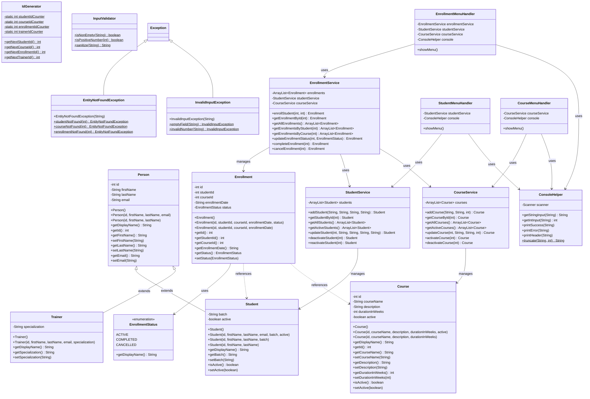

# LearnTrack - Student & Course Management System

A console-based Java application for managing students, courses, and enrollments. This project demonstrates core Java concepts including OOP principles, collections, exception handling, and clean code practices.

## 📋 Project Overview

LearnTrack is designed as a learning project to practice:
- Java basics (variables, data types, control flow)
- Classes, objects, constructors
- Static vs instance members
- OOP principles (encapsulation, inheritance, polymorphism)
- Collections (ArrayList)
- Basic exception handling
- Clean, modular code design

## 🚀 Features

### Student Management
- Add new students with optional email and batch
- View all students in tabular format
- Search students by ID
- Update student information
- Deactivate/Reactivate students (soft delete)

### Course Management
- Add new courses with duration
- View all courses
- Search courses by ID
- Update course details
- Activate/Deactivate courses

### Enrollment Management
- Enroll students in courses
- View all enrollments
- View enrollments by student or course
- Mark enrollments as completed
- Cancel enrollments

## 🛠️ Prerequisites

- **JDK 11 or higher** (tested with JDK 17)
- Command line terminal (PowerShell, CMD, or Bash)

## 📁 Project Structure

```
LearnTrack/
├── src/
│   └── com/
│       └── airtribe/
│           └── learntrack/
│               ├── entity/
│               │   ├── Person.java          # Base class for persons
│               │   ├── Student.java         # Student entity (extends Person)
│               │   ├── Trainer.java         # Trainer entity (extends Person)
│               │   ├── Course.java          # Course entity
│               │   ├── Enrollment.java      # Enrollment entity
│               │   └── EnrollmentStatus.java # Enum for enrollment status
│               ├── service/
│               │   ├── StudentService.java  # Student CRUD operations
│               │   ├── CourseService.java   # Course CRUD operations
│               │   └── EnrollmentService.java # Enrollment operations
│               ├── exception/
│               │   ├── EntityNotFoundException.java
│               │   └── InvalidInputException.java
│               ├── util/
│               │   ├── IdGenerator.java     # Auto-increment ID generator
│               │   └── InputValidator.java  # Input validation utilities
│               └── ui/
│                   ├── Main.java            # Application entry point
│                   ├── ConsoleHelper.java   # Console I/O utilities
│                   ├── StudentMenuHandler.java  # Student menu operations
│                   ├── CourseMenuHandler.java   # Course menu operations
│                   └── EnrollmentMenuHandler.java # Enrollment menu operations
├── docs/
│   ├── Setup_Instructions.md
│   ├── JVM_Basics.md
│   └── Design_Notes.md
└── README.md
```

## 🔧 How to Compile and Run

### Using Command Line

1. **Navigate to the project directory:**
   ```bash
   cd c:\Projects\Misc\LearnTrack
   ```

2. **Create the bin directory (if not exists):**
   ```bash
   mkdir bin
   ```

3. **Compile all Java files:**
   ```bash
   javac -d bin src/com/airtribe/learntrack/entity/*.java src/com/airtribe/learntrack/exception/*.java src/com/airtribe/learntrack/util/*.java src/com/airtribe/learntrack/service/*.java src/com/airtribe/learntrack/ui/*.java
   ```

4. **Run the application:**
   ```bash
   java -cp bin com.airtribe.learntrack.ui.Main
   ```

### Using an IDE (IntelliJ IDEA / Eclipse / VS Code)

1. Open the project folder in your IDE
2. Mark `src` as the Sources Root
3. Run the `Main.java` file

## 📊 Class Diagram



## 🏗️ Architecture

The application follows a **layered architecture** with proper separation of concerns:

| Layer | Package | Responsibility |
|-------|---------|----------------|
| **UI** | `ui` | User interaction, menu display, input handling |
| **Service** | `service` | Business logic, CRUD operations |
| **Entity** | `entity` | Data models (POJOs) |
| **Exception** | `exception` | Custom exceptions |
| **Utility** | `util` | Helper classes (ID generation, validation) |

### Key Design Decisions

1. **Package-Private Menu Handlers**: `StudentMenuHandler`, `CourseMenuHandler`, and `EnrollmentMenuHandler` use default (package-private) access modifier for proper encapsulation - only accessible within the `ui` package.

2. **Defense in Depth**: Input sanitization happens at both UI layer (`ConsoleHelper.getStringInput()`) and Service layer (`InputValidator.sanitize()`).

3. **Single Responsibility**: Each handler class manages only its domain (Student, Course, or Enrollment).

4. **Dependency Injection**: Services are passed via constructor rather than instantiated internally, improving testability.

## 📚 Documentation

- [Setup Instructions](docs/Setup_Instructions.md) - JDK installation and project setup
- [JVM Basics](docs/JVM_Basics.md) - Understanding JDK, JRE, JVM, and bytecode
- [Design Notes](docs/Design_Notes.md) - Design decisions and rationale

## 🎯 Learning Objectives Covered

| Concept | Implementation |
|---------|----------------|
| Encapsulation | Private fields with getters/setters; package-private classes for internal use |
| Inheritance | `Student` and `Trainer` extend `Person` |
| Polymorphism | `getDisplayName()` overridden in subclasses |
| Constructor Overloading | Multiple constructors in `Student`, `Person`, `Course` |
| Static Members | `IdGenerator` with static counters and methods |
| Collections | `ArrayList` used in all service classes |
| Exception Handling | Custom exceptions with factory methods |
| Clean Code | Separation of concerns (entity/service/ui), DRY principle |
| Access Modifiers | Public, private, and package-private used appropriately |

## 📝 Sample Usage

```
============================================
   Welcome to LearnTrack Management System  
============================================

--------------------------------------------
               MAIN MENU                    
--------------------------------------------
  1. Student Management
  2. Course Management
  3. Enrollment Management
  0. Exit
--------------------------------------------
Enter your choice: 1

============ STUDENT MANAGEMENT ============
  1. Add New Student
  2. View All Students
  3. Search Student by ID
  4. Update Student
  5. Deactivate Student
  6. Reactivate Student
  0. Back to Main Menu
=============================================
Enter your choice: 1

--- Add New Student ---
Enter First Name: John
Enter Last Name: Doe
Enter Email (optional, press Enter to skip): john@email.com
Enter Batch: 2024-A

[SUCCESS] Student added successfully!

+--------------------------------------+
| STUDENT DETAILS                      |
+--------------------------------------+
| ID:         1
| Name:       John Doe (Batch: 2024-A)
| Email:      john@email.com
| Batch:      2024-A
| Status:     Active
+--------------------------------------+
```

## 👤 Author

Created as a learning project for practicing Core Java fundamentals.

## 📄 License

This project is for educational purposes.
